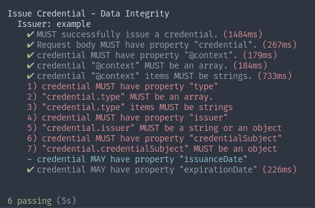

Configurations for your issuer and verifier are placed within this folder.
**Each issuer/verifier should correspond to a single config file with a .cjs
file extension.**

The name of the config file will be used as the issuer/verifier name in the test
output. An example configuration is supplied below.

```js
/**
 * A configuration file should export an object containing an issuer and a
 * verifier object with an id and endpoint.
 */
module.exports = {
  issuer: {
    /**
     * This is the label of the issuer instance that will be displayed in the
     * playground.
     * @example
     * label: 'Veres Demo Issuer'
     */
    label: "",
    /**
     * This is the (optional) id of the issuer instance, usually a DID.

     * @example
     * id: 'did:key:z6MkrHKzgsahxBLyNAbLQyB1pcWNYC9GmywiWPgkrvntAZcj'
     */
    id: "",
    /**.
     * This is the credential issuance endpoint on the issuer. This endpoint
     * should follow the specifications outlined in the VC API. Issuer tests in
     * this test suite will be run against this endpoint.
     * @example
     * endpoint: 'https://your.issuer.com/credentials/issue'
     * @see {@link https://w3c-ccg.github.io/vc-api/|VC API}
     */
    endpoint: "",
  },
  verifier: {
    /**
     * This is the label of the verifier instance that will be displayed in the
     * playground.
     * @example
     * label: 'Veres Demo Verifier'
     */
    label: ""
    /**
     * This is the (optional) id of the verifier instance, usually a DID.
     * @example
     * id: 'did:key:z6MkrHKzgsahxBLyNAbLQyB1pcWNYC9GmywiWPgkrvntAZcj'
     */
    id: "",
    /**.
     * This is the presentations verification endpoint on the verifier. This
     * endpoint should follow the specifications outlined in the VC API.
     * Verifier tests in this test suite will be run against this endpoint.
     * @example
     * endpoint: 'https://your.verifier.com/presentations/verify'
     * @see {@link https://w3c-ccg.github.io/vc-api/|VC API}
     */
    endpoint: "",
  },
};
```

Once your configuration is written, the test suite can be run. Running the test
should output the results of each test case against your issuer or verifier in
the terminal the tests were run out of. Any test case failures will have reasons
for failure listed out at the end of the test output.


